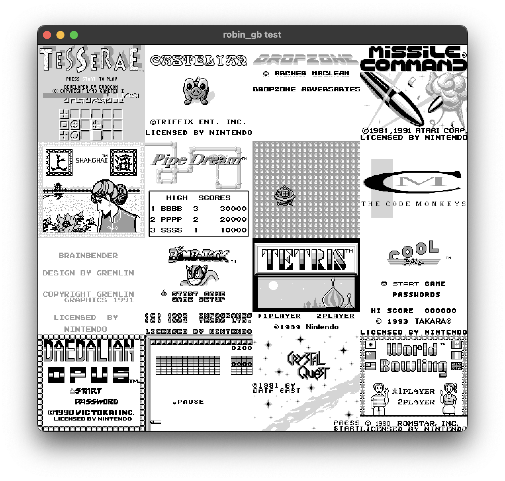

# 🦀`robin_gb`🎮
**A crate for Game Boy emulation**

This is predominantly a library crate to be used in other projects, but a test app is included. There's lots of work on accuracy and rendering still to do but simple games like Tetris run well. Next steps are to setup CI/CD for automated testing.

